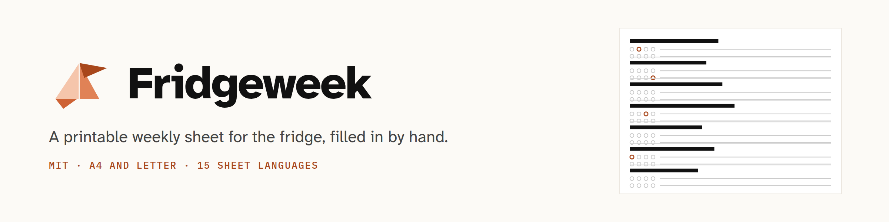
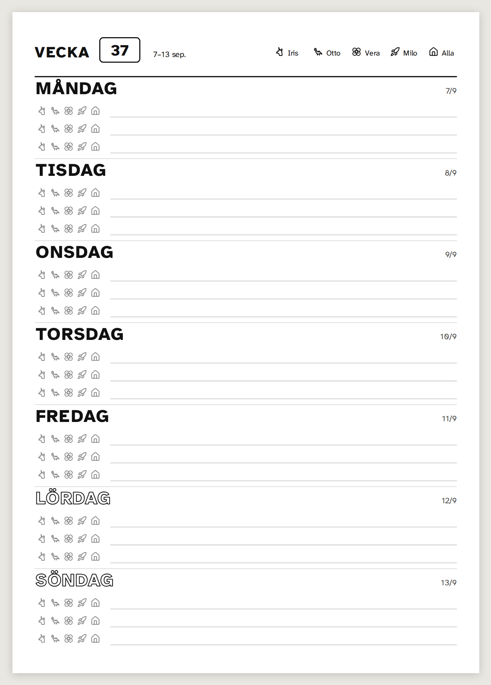
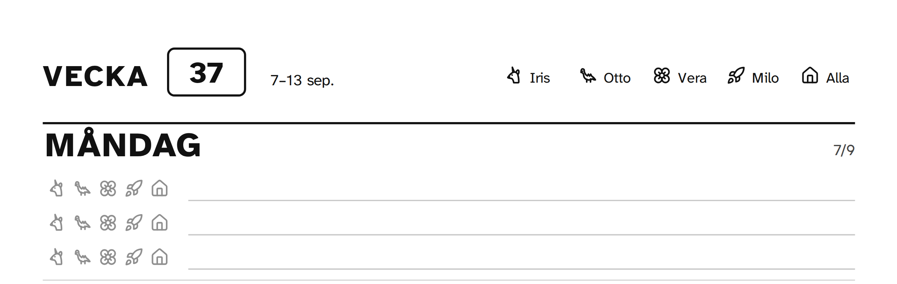
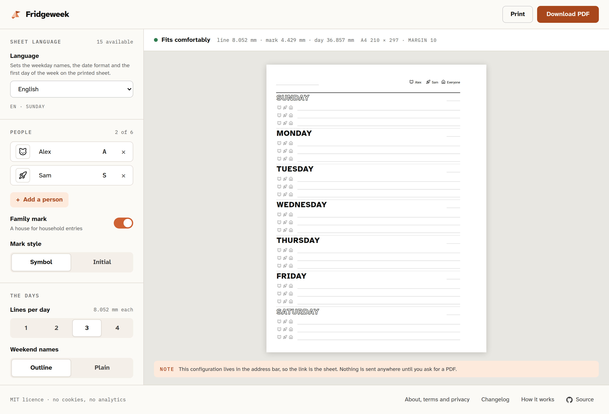

<picture>
  <source media="(prefers-color-scheme: dark)" srcset="docs/banner-dark.png">
  <source media="(prefers-color-scheme: light)" srcset="docs/banner-light.png">
  
</picture>

[](https://github.com/eckberg/fridgeweek/actions/workflows/ci.yml)
[](LICENSE)

Fridgeweek turns a handful of parameters into a print-ready weekly sheet: one week, seven
days top to bottom, filled in by hand and stuck on the fridge. There is no screen view, no
sync and no account. You print it and write on it with a pen.

It is built for households with pre-school and early-school children who already draw this
sheet by hand every week and want to stop redrawing the skeleton.

## The sheet



Every decision on that page is in [DESIGN.md](DESIGN.md), with the reason next to it. The
ones you can see:

- **Seven days, equal height.** Sunday gets the same space as Wednesday. A child who cannot
  read finds today by counting rows, so a busy Thursday must not be allowed to grow.
- **Weekday names in uppercase, large.** Pre-readers recognise capitals first.
- **One to four writing lines a day, three by default.** Real weeks are sparse. A fixed box
  per person leaves most boxes empty and overflows on the busy days.
- **A marker strip on every writing line.** One small mark per person, up to six, plus a
  house for the whole household. Circle a mark and the line belongs to that person, so any
  line can be anyone's and nobody gets a box that stays empty.
- **A mark is a symbol or an initial.** Symbols suit pre-readers, initials suit adults; the
  choice is made once for the whole sheet.
- **Weekend names as outline text.** They separate the weekend from the week in mono print,
  and a child can colour them in.
- **Mono only.** Colour is decoration, never information, so a cheap laser printer and
  whatever paper is in the tray is enough. A4 and Letter, portrait.



The header is optional and each part has its own toggle: week number, date range, and a
legend pairing every symbol with a name. Dates are blank by default, which suits printing
a stack of sheets at a time. Set a week starting date and the sheet prints the week number, the
range and each day's date, with the same layout either way.

Nothing is ever shrunk silently. The layout engine is a pure function that returns every
coordinate in millimetres plus a list of issues: a line below 6 mm is unwritable with a
normal pen, so that configuration is an error with concrete remedies rather than a smaller
sheet. On A4 with a 10 mm margin, three lines a day come out at 8.052 mm and four at 6.039
mm, which the engine reports as tight. See
[DESIGN.md section 4](DESIGN.md#4-layout-engine) for the height budget.

## Non-goals

These are deliberate, and copied here from [DESIGN.md](DESIGN.md#non-goals) because they are
the fastest way to decide whether you want to contribute. Feature requests that cross them
are closed with a link, which is a scope boundary and not a judgement of the idea.

- No calendar sync, no accounts, no server-side storage of any kind.
- No content is ever pre-printed except dates. The sheet is a skeleton; the value is that it
  stays paper.
- No screen view, no app, no recurring events.
- No poster aesthetics. The sheet is plain, dense and functional, printed in black on
  whatever paper you have.

## The builder



The website is an Astro site with one Vue island. The config lives in the URL hash, so the
link is the sheet, and in `localStorage` for convenience. The bar above the preview is the
layout engine's own report: whether it fits, and the millimetres it arrived at.

There is no hosted instance yet. Everything below runs on your own machine.

## Development

You need Node 22 and pnpm 10. Enable pnpm with corepack:

```sh
corepack enable
```

Then, from the repository root:

```sh
pnpm install       # install workspace dependencies
pnpm test          # unit and snapshot tests
pnpm typecheck     # TypeScript, Astro and Vue diagnostics
pnpm lint          # Biome
pnpm build         # build both packages
pnpm sample        # writes example sheets to examples/out/
```

`pnpm sample` also refreshes [`docs/preview.svg`](docs/preview.svg). Open one of the files in
`examples/out/` in a browser and print it: that HTML is exactly what the site previews and
what the PDF route renders.

To run the website:

```sh
pnpm --filter @fridgeweek/web dev      # http://localhost:4321
pnpm --filter @fridgeweek/web build    # then `preview` to serve the built site
```

The browser tests use Playwright. Install the browser once, then run them:

```sh
pnpm exec playwright install chromium
pnpm test:visual   # sheet screenshots, from packages/core
pnpm test:e2e      # drives the built website
```

That same Chromium is what renders PDFs locally, so installing it also turns on the
**Download PDF** button. `POST /api/pdf` validates the config with the same function the
browser uses, renders it and streams the bytes back. A deployment without a renderer answers
501, and the interface says to print instead, which every browser can save as a PDF. Set
`CHROMIUM_PATH` if Playwright cannot find a browser.

Built for Cloudflare with `DEPLOY_TARGET=cloudflare`, the same route renders through
Cloudflare Browser Rendering instead of a local Chromium. That path is entirely optional and
is the only part of this project that costs money; [docs/DEPLOYING.md](docs/DEPLOYING.md)
covers all three deployments.

No account, key or hosting platform is needed to run or develop this project.

## Repository layout

| Path | What it is |
|---|---|
| `packages/core` | The `@fridgeweek/core` package: config validation and encoding, the layout solver, the SVG and HTML renderers, symbols, embedded fonts, date and week-number helpers, and the sheet's own words. Strict TypeScript, no runtime dependencies, no DOM access, so it runs the same in Node, in a browser and in a Worker. |
| `apps/web` | The website. Astro, static except for the PDF route, with one Vue island for the builder. Self-hosted fonts, no third-party requests, no analytics, no cookies. |
| `docs` | Pictures for this file. The banner is drawn in `banner.svg` and both PNG variants are rendered from it, `preview.svg` is regenerated by `pnpm sample`, and the rest are screenshots kept from the design boards. |
| `examples/out` | Sample sheets. Generated, not committed. |

`packages/core` resolves to its TypeScript source inside the workspace, so nothing needs
building before `apps/web` can run. Its exported surface is listed in
[packages/core/README.md](packages/core/README.md) and specified in
[DESIGN.md section 7](DESIGN.md#7-architecture).

## Languages

**The sheet is translated; the interface is not.** The sheet is the product, so it prints in
a family's own language. The website around it is English on purpose: one set of words to
maintain, one page to review.

Almost everything printed comes from the browser's own locale data. Weekday names, day
dates, the date range, the first day of the week and the week-numbering rule all come from
`Intl`, which is why a sheet is correct in far more languages than are listed anywhere.
Exactly two words are the project's own, "Week" and "Everyone", and they live in
`packages/core/src/i18n/locales/<lang>.json`. Fifteen languages have that file and are what
the picker offers. A locale without one still prints a correct sheet; those two words fall
back to English.

Symbol names appear in the picker and to screen readers, never on paper, so they are English
only. [DESIGN.md section 6](DESIGN.md#6-dates-and-language) has the details.

## Testing

`pnpm test` runs the unit and snapshot tests: config validation, encoding round-trips, week
numbers, week-info fallbacks, the layout solver across A4 and Letter with one to six people
and one to four lines, the URL state and the builder store. The renderers are deterministic
by contract, with numbers rounded to three decimals and no timestamps, which is what makes
the SVG snapshots meaningful.

`pnpm test:visual` renders sheets in Chromium at print media and compares them against
committed screenshots, including the locales with the widest weekday names. `pnpm test:e2e`
drives the built site, and checks every page with axe. CI runs all of it on every pull
request.

## Contributing

Bug reports, fixes and small improvements are welcome. Read
[CONTRIBUTING.md](CONTRIBUTING.md) for setup, the ground rules and the pull request
checklist, and read [DESIGN.md](DESIGN.md) before proposing a feature.

The two contributions we want most:

- **[A new language](CONTRIBUTING.md#adding-a-language)** is a two-line JSON file plus an
  entry in a list. Corrections to an existing translation are as welcome as new languages;
  every one of them was written by its author rather than by a native speaker, and being a
  speaker is the whole justification you need.
- **[A new symbol](CONTRIBUTING.md#adding-a-symbol)** is an id added to the curated Lucide
  list, or a small icon drawn to the same conventions.

Neither needs you to understand the layout engine.

## Licence

The code is MIT. See [LICENSE](LICENSE).

Bundled third-party assets keep their own licences: the Atkinson Hyperlegible Next typeface
(SIL OFL 1.1) and the Lucide icons (ISC). See
[THIRD_PARTY_NOTICES.md](THIRD_PARTY_NOTICES.md), which also explains why a sheet you print
carries no notice, no credit line and no logo.
