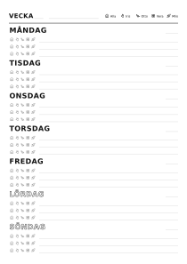

# Fridgeweek

A printable weekly sheet for the fridge, filled in by hand.

## What it is

Fridgeweek is a web page where you set a handful of parameters and get a print-ready sheet: one week, seven days top to bottom. You print it, stick it on the fridge and write on it with a pen. There is no screen view, no sync and no account. It is built for households with pre-school and early-school children who already draw this sheet by hand every week and want to stop redrawing the skeleton.



## Non-goals

These are deliberate. Feature requests that cross them are closed with a link to [DESIGN.md](DESIGN.md).

- No calendar sync, no accounts, no server-side storage of any kind.
- No content is ever pre-printed except dates. The sheet is a skeleton; the value is that it stays paper.
- No screen view, no app, no recurring events.
- No poster aesthetics. The sheet is plain, dense and functional, printed in black on whatever paper you have.

## How it works

The page is one column of seven days, top to bottom, all the same height. Sunday gets the same space as Wednesday, so a child who cannot read can find today by counting rows. Weekday names are set in uppercase because pre-readers recognise capitals first, and weekend names can be drawn as outline text so they stand out in mono print and can be coloured in.

Each day has one to four free writing lines, three by default. Every line begins with a marker strip: one small mark per person, plus a family mark for household entries. Circle a mark and the line belongs to that person. A mark is either a symbol from a curated icon set or the person's initial, chosen once for the whole sheet. Symbols suit pre-readers, initials suit adults.

The header is optional and each part has its own toggle: week number, date range, and a legend that pairs every symbol with a name. Dates are blank by default, which suits printing twenty sheets at a time. Set a week starting date and the sheet prints the week number, the range and each day's date, with the same layout either way.

Output is mono only. Colour is decoration, not information, so a cheap laser printer and whatever paper you have is enough. Both A4 and Letter are supported in portrait.

## Status

Early development, and everything runs locally with no account, key or hosting platform.

- `@fridgeweek/core` is complete: config, layout solver, renderer, symbols, embedded fonts, dates and i18n.
- The website has a landing page, an about page and the sheet builder with a live preview. The interface is English; the *sheet* prints in 15 languages, and correctly in many more, because weekday names and dates come from the browser's own locale data.
- `POST /api/pdf` renders a PDF with a local Chromium. Deployments without a renderer answer 501 and the interface tells people to print instead, which every browser can save as a PDF.

See [DESIGN.md section 9](DESIGN.md#9-milestones) for the milestones and [PLAN.md](PLAN.md) for what this phase set out to build.

## Repository layout

- `packages/core`: the `@fridgeweek/core` package. Config validation and encoding, the layout solver, the SVG and HTML renderers, symbols, embedded fonts, date and week-number helpers, and UI strings. Strict TypeScript, no runtime dependencies, no DOM access.
- `apps/web`: the website. An Astro site, static except for the PDF route, with one Vue island for the builder. Self-hosted fonts, no third-party requests, no analytics, no cookies.

## Development

You need Node 22 and pnpm 10. Enable pnpm with corepack:

```sh
corepack enable
```

Then:

```sh
pnpm install       # install workspace dependencies
pnpm test          # unit and snapshot tests
pnpm typecheck     # TypeScript and Astro diagnostics
pnpm lint          # Biome
pnpm sample        # writes example HTML files to examples/out/
```

To run the website:

```sh
pnpm --filter @fridgeweek/web dev      # http://localhost:4321
pnpm --filter @fridgeweek/web build    # then `preview` to serve the built site
```

The browser tests use Playwright. Install the browser once, then run them:

```sh
pnpm exec playwright install chromium
pnpm test:visual   # sheet screenshots, from packages/core
pnpm test:e2e      # drives the built website
```

The same browser is what renders PDFs locally, so installing it also turns on the PDF button.

## Contributing

Bug reports, fixes and small improvements are welcome. Read [CONTRIBUTING.md](CONTRIBUTING.md) for setup, the ground rules and the pull request checklist, and read [DESIGN.md](DESIGN.md) before proposing a feature. The two contributions we want most are a new language and a new symbol. Both have a step-by-step recipe in CONTRIBUTING.md, and neither needs you to understand the layout engine.

## License

The code is MIT. See [LICENSE](LICENSE).

Bundled third-party assets keep their own licenses: the Atkinson Hyperlegible Next typeface (SIL OFL 1.1) and the Lucide icons (ISC). See [THIRD_PARTY_NOTICES.md](THIRD_PARTY_NOTICES.md).
